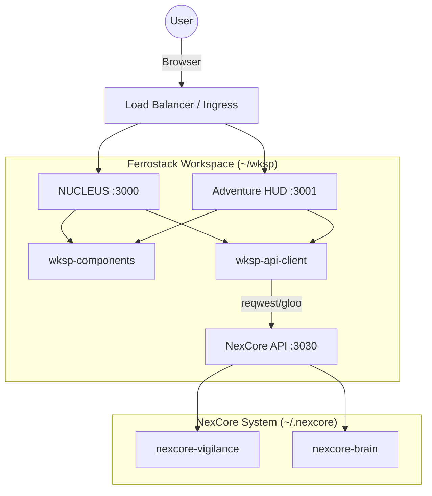

# Ferrostack Unified Workspace

This workspace consolidates the NexVigilant frontend application layer ("Ferrostack") and experimental labs into a single Rust workspace.

## 🚀 Quick Start

### 1. Build & Test

The workspace uses a unified dependency graph. All commands run from `~/wksp/`.

```bash
# Validate everything (Strict lints enforced)
cargo check --workspace
cargo clippy --workspace -- -D warnings
cargo test --workspace   # All 18 wksp-owned members (nexcore path deps excluded)

# Run a specific app (e.g., NUCLEUS)
cd apps/nucleus && cargo leptos watch
```

### 2. Run Applications

Each app is assigned a dedicated port to allow simultaneous development.

| App | Port | Description | Tier |
|-----|------|-------------|------|
| **nucleus** | 3000 | Mobile PWA (Production) | Production |
| **adventure-hud** | 3001 | Game HUD | Experimental |
| **borrow-miner** | 3002 | Ore mining game | Experimental |
| **education-machine** | 3003 | Educational content | Experimental |
| **ferro-clicker** | 3004 | Clicker game | Experimental |
| **ferro-explore** | 3005 | Exploration tool | Experimental |
| **nexcore-watch-app** | 3006 | Galaxy Watch 7 | Experimental |

**Note:** `nexcore-watch-app` requires Android build targets (`cargo apk` or similar) for device deployment.

## 🏗 Architecture



### Key Components

- **`crates/wksp-core`**: Workspace-wide error types and configuration.
- **`crates/wksp-api-client`**: Typed client for `nexcore-api` (SSR + Hydrate).
- **`crates/wksp-components`**: Reusable Leptos components (Card, Input, Modal).
- **`apps/*`**: Leptos 0.7 applications (SSR + Hydrate).
- **`labs/*`**: Pure Rust experiments (data science, primitive research).

## 🛠 Development Workflow

### Adding a Dependency

1. **Prefer `workspace = true`**: Check if `~/wksp/Cargo.toml` already defines it.
2. **Strict Lints**: All new code must pass `clippy::unwrap_used`, `clippy::expect_used`, and `clippy::panic`.
3. **WASM Compatibility**: Any code in `apps/` must compile to `wasm32-unknown-unknown` (except `ssr` feature blocks).

### Ferrostack MCP

Use the `lessons-mcp` tool for workspace insights:

- `mcp__ferrostack__project_init`: Initialize new projects.
- `mcp__ferrostack__doctor`: Check workspace health.

## 📦 Deployment (Cloud Run)

Each app in `apps/` can be built as a Docker container.

```bash
docker build -t nucleus -f apps/nucleus/Dockerfile .
```

(Ensure Dockerfile context is set to workspace root if using workspace deps).

## 🧪 Verification Gates

Verified compliant with **Compendious Coding** standards.

- **CDI (Code Density Index)**: > 0.15 target.
- **Bloat**: Zero tolerance for duplicate structs.
- **Safety**: `unsafe` strictly forbidden outside `wksp-core` primitives.
